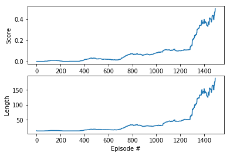

# Continuous Control Project Report

## Environment

This is an example of Deep Deterministic Policy Gradient reinformcement learning in a simple game environment with multiple agents.
The goal is to train two agents to play tennis together, with longer play sessions getting higher rewards.

Some pre-trained model weights are provided. A GPU is preferred for training.

For more information, please see the introduction to the original github project [here] ( https://github.com/udacity/deep-reinforcement-learning/tree/master/p3_collab-compet ).

## Environment

This is an example of an Actor-Critic Deep Reinforcement Learning method in a simple game environment.
The goal is to get two agents to play tennis.

The environment is provided as a custom Unity project from Udacity, found here in the `Tennis_Linux` folder.
The original Linux environment can be downloaded [here] (https://s3-us-west-1.amazonaws.com/udacity-drlnd/P3/Tennis/Tennis_Linux.zip).

The environment has 24 states. 
Two continuous actions are available, corresponding to movement toward (or away from) the net, and jumping.

##Algorithm

After some attempts to get a multi-agent version working, I decided to go with a single Deep Deterministic Policy Gradient Learning setup for both agents, based on what I did for the last assignment.

Again I found this to be a difficult algorithm to set hyperparameters for, mostly amounting to a lot of trial and error.
While I did find a solution, and it fulfills the assignment, I don't consider it to be especially stable. 

## Settings

There are two models here, an actor and a critic, that perform the evaluation and improvement steps. These are basically the same as the defaults in the provided code. The main difference was to add some code so that updates were not performed on every time step, as per the suggestions in the Benchmark Implementation.
I also added some code to try preloading the buffer but it didn't make any real difference to the outcome.
I ended up increasing the size of the memory buffer to 100000 entries, and set the batch size to 64. 
I also tried several learning rates and ended up going with .001 for the actor and .0001 for the critic.
I also added a small epsilon reduction to the noise, and found a slight increase in the tau parameter (0.003) gave a small amount of improvement.

Here is a table of the main hyperparameter settings:

File | Parm | Setting
-----|-----|-------
ddpg_agent | BUFFER_SIZE | 100000
ddpg_agent | BATCH_SIZE | 64
ddpg_agent | TAU | 0.003
ddpg_agent | LR_ACTOR | 0.001
ddpg_agent | LR_CRITIC | 0.0001
ddpg_agent | GAMMA | 0.99
model | actor fc1 | 256
model | actor fc2 | 256
model | critic fc1 | 256
model | critic fc2 | 128
model | critic fc3 | 64
main | seed | 123


In general I've found that setting the hyperparameters for reinforcement learning to be the most difficult part of all these assignments.

## Outcome

The run I've shown here solved the environment (>.5=.5008) in 1493 episodes.
This has been my best run so far.

```
Episode 50	Average Score: 0.0000	Max t: 13.20	mem: 1420
Episode 100	Average Score: 0.0057	Max t: 14.14	mem: 3028
Episode 150	Average Score: 0.0094	Max t: 14.81	mem: 4582
Episode 200	Average Score: 0.0037	Max t: 13.98	mem: 6024
Episode 250	Average Score: 0.0000	Max t: 13.31	mem: 7444
Episode 300	Average Score: 0.0010	Max t: 13.39	mem: 8902
Episode 350	Average Score: 0.0010	Max t: 13.42	mem: 10328
Episode 400	Average Score: 0.0161	Max t: 16.05	mem: 12312
Episode 450	Average Score: 0.0303	Max t: 18.70	mem: 14268
Episode 500	Average Score: 0.0256	Max t: 18.13	mem: 16138
Episode 550	Average Score: 0.0210	Max t: 17.49	mem: 17966
Episode 600	Average Score: 0.0199	Max t: 17.62	mem: 19862
Episode 650	Average Score: 0.0162	Max t: 17.34	mem: 21634
Episode 700	Average Score: 0.0198	Max t: 18.86	mem: 23834
Episode 750	Average Score: 0.0555	Max t: 28.16	mem: 27466
Episode 800	Average Score: 0.0732	Max t: 33.56	mem: 30746
Episode 850	Average Score: 0.0673	Max t: 32.23	mem: 34112
Episode 900	Average Score: 0.0618	Max t: 28.51	mem: 36648
Episode 950	Average Score: 0.0625	Max t: 28.93	mem: 40098
Episode 1000	Average Score: 0.0812	Max t: 31.35	mem: 43118
Episode 1050	Average Score: 0.0908	Max t: 32.18	mem: 46734
Episode 1100	Average Score: 0.1094	Max t: 44.69	mem: 52256
Episode 1150	Average Score: 0.1157	Max t: 49.29	mem: 56792
Episode 1200	Average Score: 0.1012	Max t: 46.22	mem: 61700
Episode 1250	Average Score: 0.1078	Max t: 50.49	mem: 67090
Episode 1300	Average Score: 0.1536	Max t: 66.20	mem: 75140
Episode 1350	Average Score: 0.3082	Max t: 121.85	mem: 91660
Episode 1400	Average Score: 0.4008	Max t: 154.54	mem: 100000
Episode 1450	Average Score: 0.4112	Max t: 155.90	mem: 100000
Episode 1493	Average Score: 0.5008	Max t: 189.23	mem: 100000
Environment solved in 1393 episodes!	Average Score: 0.5008

```




## Future Work

I experimented with parameters and this seems to meet the requirements for the class. I'm sure it's possible to do better. 
In particular, I can see in the class forum that some people have achieved results that faster, so there is room for improvement.

The future work I would like to do is to experiment more with improving the stability of the algorithm, and to try to come up with better guidelines for setting hyperparameters.

I would also like to try working with an actual multi-agent version of this, perhaps using the soccer environment that is provided as a second, optional assignment.
